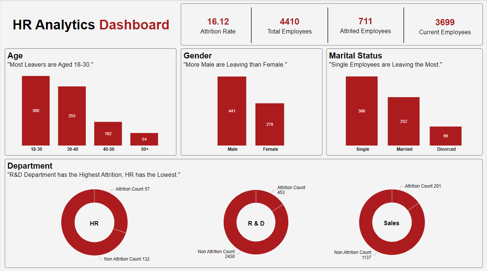
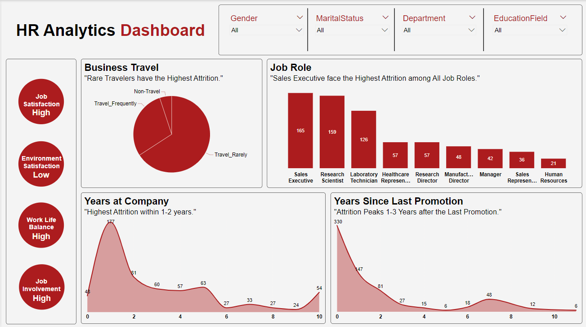

# Employee Attrition Analysis Project
Analyzing Employee Attrition Data to Uncover key factors driving turnover at XYZ Company using Power BI. This project includes ETL processes, Data Modeling, and Insights to Help Improve Retention Strategies and Employee Engagement.

## Table of Contents
- [Introduction](#introduction)
- [Objective](#objective)
- [Data Overview](#data-overview)
- [Data Preparation](#data-preparation)
- [Data Modeling](#data-modeling)
- [Dashboard Overview](#dashboard-overview)
- [Key Insights](#key-insights)
- [Recommendations](#recommendations)
- [Conclusion](#conclusion)
- [Installation](#installation)
- [Usage](#usage)
- [Contributing](#contributing)
- [License](#license)

## Introduction
Employee attrition is a significant challenge for companies looking to retain talent and maintain a productive workforce. This project focuses on analyzing employee attrition at XYZ Company to identify the main factors influencing turnover and provide actionable insights to improve retention strategies. Power BI were used to transform raw data into an interactive dashboard that HR teams can use for data-driven decision-making.
## Objective
The main objective of this project is to analyze employee data and provide insights to help XYZ Company reduce its 15% attrition rate. The specific goals are:
- **Identify Attrition Factors**: Analyze key metrics like job satisfaction, work-life balance, and tenure to identify patterns contributing to attrition.
- **Analyze Departmental and Role-Specific Trends**: Examine which departments and roles have the highest turnover rates.
- **Provide Strategic Recommendations**: Offer actionable recommendations to improve employee retention.
- **Interactive Dashboard**: Create a dynamic Power BI dashboard for visual exploration of insights.

## Data Overview
The dataset includes multiple attributes about employees such as:
- Employee ID
- Age
- Gender
- Marital Status
- Job Level
- Monthly Income
- Environment Satisfaction
- Job Satisfaction
- Work-Life Balance
- Years at Company
- Years Since Last Promotion

## Data Preparation
1. **Data Extraction**: The dataset was obtained from a provided link, with EmployeeID used as the primary key for sequential arrangement.
2. **Data Cleaning**: Missing values in columns like TotalWorkingYears, EnvironmentSatisfaction, JobSatisfaction, and WorkLifeBalance were handled by filling them with the median.
3. **Data Transformation**: The dataset was normalized and divided into multiple tables (Employee Details, Job Details, Travel Details, Education Details) connected by a primary key, EmployeeID.
4. **Data Loading**: Transformed data was loaded into Power BI for further analysis.

## Data Modeling
The data model uses a star schema, with the Attrition Fact Table at the center, connected to dimension tables:
- **Employee Details**
- **Job Details**
- **Education Details**
- **Travel Details**
- **Measure Table**

## Dashboard Overview
The Power BI dashboard provides an interactive overview of employee attrition with key metrics and visuals:
- **KPIs**: Attrition Rate, Total Employees, Attrited Employees, Current Employees
- **Slicers**: Gender, Marital Status, Department, Education Field
- **Charts**: Attrition by Age, Gender, Marital Status, Job Role, Business Travel, Job Satisfaction, Work-Life Balance
  
## Key Insights
- A total of 513,000 units were sold, generating $137.35 million in revenue with a profit margin of 32.16%.
- Cosmetics lead with $15 million in sales, followed by office supplies ($8 million) and household products ($7 million).
- Sub-Saharan Africa is the top region with $12.2 million in sales.
- The top countries include Djibouti ($2.43 million) and Pakistan ($1.72 million).
- A significant rise in online sales from 2012 to 2017.
- The average shipping time is 23 days.

## Recommendations
- **Expand High-Demand Categories**: Increase the product range in cosmetics, office supplies, and household products.
- **Reassess Underperforming Categories**: Consider replacing low-demand items with more popular products.
- **Target Low-Sales Regions**: Boost marketing efforts in North America and Central America.
- **Strengthen High-Sales Regions**: Enhance product availability and promotions in Sub-Saharan Africa and Europe.
- **Invest in Online Platforms**: Continue to grow online sales by improving digital marketing and user experience.
- **Reduce Shipping Time**: Streamline logistics to lower the average shipping time.
- **Align Stock with Demand**: Optimize inventory to match order priorities and prevent stockouts or overstocking.
- **Leverage Top Markets**: Focus on high-performing countries with localized strategies.

## Conclusion
The analysis reveals both strengths and areas for improvement in Amazon's sales performance. Key findings include robust sales in categories such as cosmetics and office supplies, strong regional performance in Sub-Saharan Africa and Europe, and a trend towards increased online sales. The implications for strategic planning include focusing on high-demand products, targeting regions with lower sales, optimizing sales channels, and improving supply chain efficiency.

## Installation
To run this project locally, you need to have the following software installed:
- [Microsoft Excel](https://www.microsoft.com/en-us/microsoft-365/excel)
- [Power BI](https://powerbi.microsoft.com/)

## Usage
1. **Amazon Dataset.csv**: This CSV file contains the raw sales data.
2. **Amazon Sales Analysis Dashboard.pbix**: Open this file in Power BI to view the interactive dashboard.
3. **Amazon Sales Report.pdf**: This PDF contains a summary report of the analysis.

### Steps to Analyze Data:
- Open the `Amazon Dataset.csv` in Excel to inspect and clean the data.
- Transform and load the dataset into Power BI.
- Explore the interactive visualizations and insights in the dashboard.

## Contributing
Contributions are welcome! Please follow these steps to contribute:
1. Fork the repository.
2. Create a new branch (`git checkout -b feature-branch`).
3. Commit your changes (`git commit -m 'Add some feature'`).
4. Push to the branch (`git push origin feature-branch`).
5. Create a new Pull Request.

## License
This project is licensed under the MIT License - see the [LICENSE](LICENSE) file for details.
